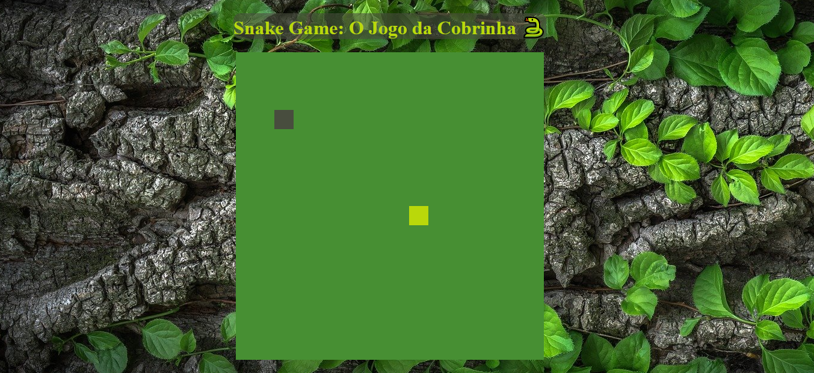

<h1>Snake Game &#x1F40D</h1>

Atividade encontrada no <strong>Bootcamp HTML Web Developer</strong> da <strong>Digital Innovation One</strong>.

Desta vez, o objetivo foi recriar o jogo da cobrinha utilizando HTML5, CSS3 e JavaScript.

Em relação ao projeto original, desenvolvido pela instrutora Gabriela Pinheiro, adicionei mudanças na aparência do jogo (CSS) e uma no JavaScript.

No CSS:

<ol>
  <li>Adicionei a propriedade <code>background-image</code> ao seletor <code>body</code> e coloquei uma imagem como pano de fundo só para não deixá-lo todo branco.</li>
  <li>Criei o seletor <code>h1</code>, incluí algumas declarações nele e também adicionei (dentro do HTML) um emoji de cobrinha ao lado do título &#x1F40D.</li>
  <li>Modifiquei as cores do <em>background</em>, da <em>food</em> e da cobrinha.</li>
</ol>

Quanto ao JavaScript, apenas acrescentei uma nova mensagem ao final do jogo, orientando o jogador como agir após o fim do game, pois o mesmo não reinicia sozinho após o Game Over! &#x1F609

O projeto concluído ficou assim:

